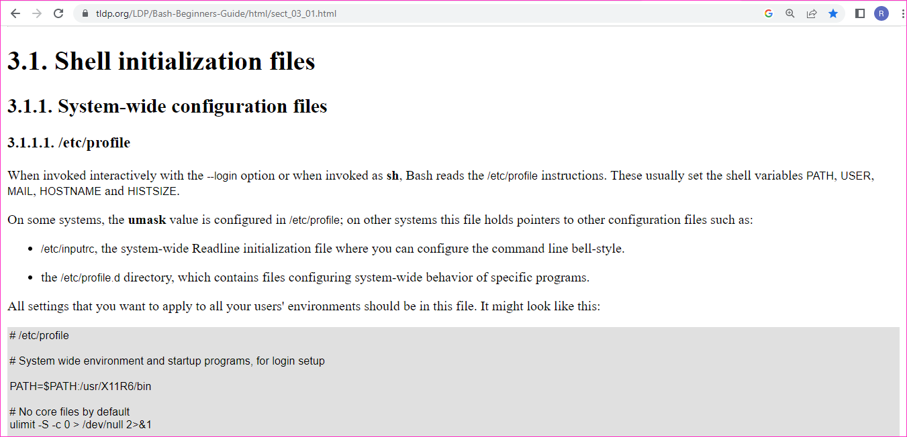
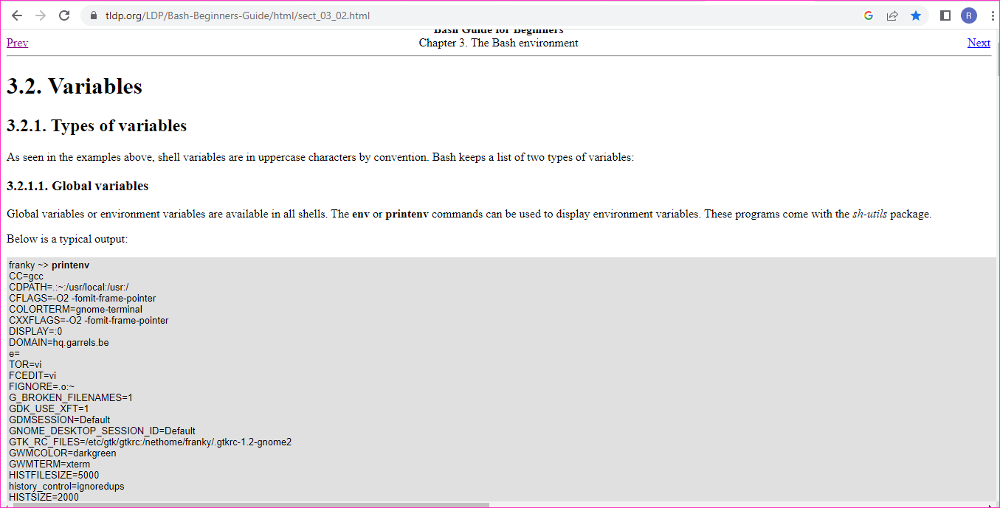
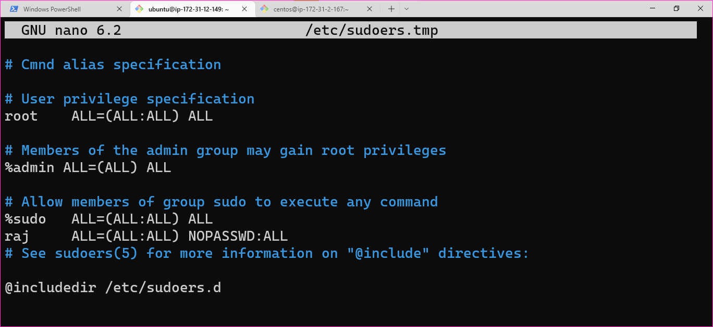
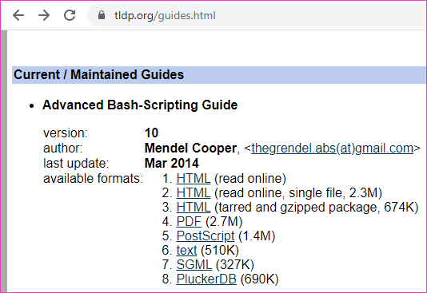

User Shell
----------

* Setting up the user shell
  * In the home directory we have file called as `.bashrc`
  * .bashrc is a configuration file in Linux that contains commands and settings specific to the bash shell. This is executed every time a new bash
  * Shell variable PS1  can be used to customize look and feel of our shell.
  * PS1 is called as primary prompt display varianle
  * Lets add the following statements in the bash rc file

```
alias proc="ps auwwx"
alias pfilter="ps auwwx"
alias start="systemctl start"
alias stop="systemctl stop"
alias enable="systemctl enable"
```

* proc = list of all process
* to filter the process according to keyword
* Adjust the bash history
  * In the bashrc file as shown in the highlighted section below
  * Bash shell remembers 1000 typed commands in history in the current session and to save more than 2000 commands in the history file called `.bash_history`
* Adjust the PATH variable
  * We can edit the ~/.profile and PATH for the current user
* SPECIAL VARIABLES in bashrc
  * PS1, PS2, PS3, PS4
    
    
    
    
    
